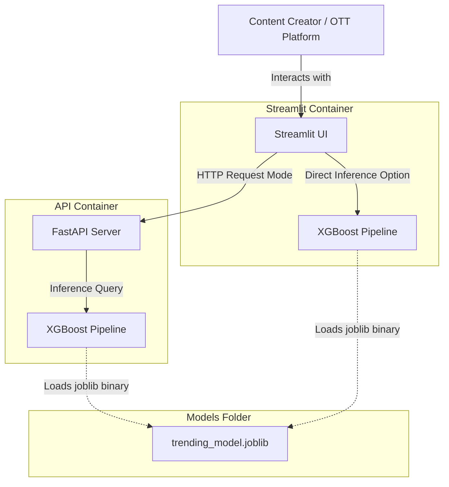
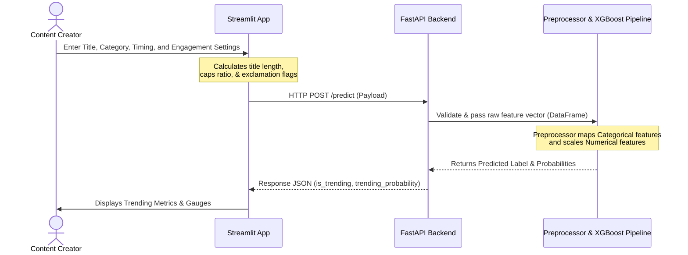

# Technical Documentation: Trending Content Predictor

This document outlines the system architecture, API reference, data flow, and code structure of the Trending Content Prediction platform.

---

## 1. System Architecture

The application is structured as a decoupled 3-tier system consisting of a Streamlit frontend, a FastAPI REST service, and an XGBoost machine learning pipeline. 

### C4 Container Diagram


---

## 2. API Reference

The backend API is implemented in FastAPI.

### Base URL
- Local Development: `http://127.0.0.1:8000`

### Endpoints

#### 1. Root Status Check
- **Endpoint:** `/`
- **Method:** `GET`
- **Description:** Verifies if the backend server is running.
- **Response Schema (`application/json`):**
  ```json
  {
    "message": "Welcome to the Trending Content Predictor API"
  }
  ```

#### 2. Model Inference Endpoint
- **Endpoint:** `/predict`
- **Method:** `POST`
- **Description:** Processes input metadata and returns the trending classification and probability.
- **Request Schema (Pydantic model `VideoRequest`):**
  ```json
  {
    "category_id": "24",
    "publish_country": "US",
    "upload_hour": 18,
    "upload_dayofweek": 4,
    "num_tags": 12,
    "title_length": 38,
    "comments_disabled": 0,
    "ratings_disabled": 0,
    "title_caps_ratio": 0.45,
    "has_exclamation": 1
  }
  ```
- **Response Schema (`application/json`):**
  ```json
  {
    "is_trending": 1,
    "trending_probability": 0.875
  }
  ```

---

## 3. Data Flow & Sequence Diagram

The sequence diagram below represents the prediction flow from the Streamlit UI to the final prediction display.



---

## 4. Codebase Reference

### Preprocessing & Machine Learning Pipeline (`src/model/train.py`)
This script contains the data ingestion, feature engineering, and model validation logic.

1. **`load_data(filepath, sample_size)`**
   - Ingests the raw CSV file.
   - Downsamples data to optimize training speeds in hackathon environments.
2. **`feature_engineering(df)`**
   - Sets the target threshold: Classifies videos as `trending` (`1`) if views are at or above the 75th percentile of the dataset.
   - Calculates title metrics: `title_length`, `title_caps_ratio`, and `has_exclamation`.
   - Formats boolean metadata: Converts interaction flags (`comments_disabled`, `ratings_disabled`) to binary integers.
3. **`train_model(filepath)`**
   - Segregates features into categorical (`category_id`, `publish_country`) and numerical sets.
   - Configures a `ColumnTransformer` executing `OneHotEncoder` and `StandardScaler`.
   - Instantiates the `XGBClassifier` with tuned hyper-parameters:
     ```python
     XGBClassifier(
         n_estimators=500,
         learning_rate=0.03,
         max_depth=10,
         subsample=0.9,
         colsample_bytree=0.9,
         eval_metric='logloss'
     )
     ```
   - Bundles preprocessors and the classifier into a Scikit-Learn `Pipeline`.
   - Trains, validates (80/20 split), prints evaluation summaries, and saves the binary model to `models/trending_model.joblib`.

### API Engine (`src/api/main.py`)
Serves the ML model via a FastAPI server.

- **`VideoRequest(BaseModel)`:** Formulates the Pydantic schema enforcing typing for all incoming request payloads.
- **`load_model()`:** Runs on server startup, executing `joblib.load()` to pull the pipeline into memory.
- **`predict_trend(video)`:** Maps incoming payload parameters directly into a Pandas DataFrame and triggers `model.predict_proba()` and `model.predict()`.

### User Interface (`src/ui/app.py`)
Provides an interactive client environment using Streamlit.

- Implements dynamic calculation of capitalization ratios and exclamation presence locally to reduce validation latency.
- Bypasses FastAPI if deployed in a serverless environment (Streamlit Cloud) by importing `joblib` and processing predictions natively on the frontend container.
